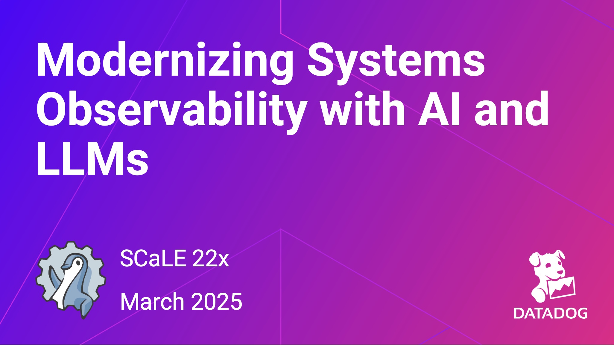

# SCaLE 22x - companion content for "Moderninizing Systems Observability with AI and LLMs"

## Resources

- [Slides](slides/SCaLE-ModernizingSystemsObservabilityWithAIandLLMs.pdf)

### Stats and Data

- [DevOps.com - Survey: Usage of AI Rapidly Expands Once DevOps Teams Adopt](https://devops.com/survey-usage-of-ai-rapidly-expands-once-devops-teams-adopt/)
- [DevOps.com - Survey Surfaces Spike in Observability Investments Among DevOps Teams](https://devops.com/survey-surfaces-spike-in-observability-investments-among-devops-teams/)
- [Anomaly Detection: AI-based Analytics on Industrial Edge](https://www.siemens.com/global/en/products/software/simatic-apps/anomaly-detection.html)
- [Amount of Data Created Daily (2024)](https://explodingtopics.com/blog/data-generated-per-day)
- [31 Mind-Blowing Statistics About Big Data For Businesses (2024)](https://www.grepsr.com/blog/31-mind-blowing-statistics-about-big-data-for-businesses-2024/)

### Research Reports

- [DevOps Next: 2024 and Beyond](https://techstrongresearch.com/resources/devops-next-2024-and-beyond/)
- [Ai Augmented Devops Trends Shaping The Future](https://www.tricentis.com/resources/ai-augmented-devops-trends-shaping-the-future)
- [2024 Gartner® Magic Quadrant™ for Digital Experience Monitoring](https://www.datadoghq.com/resources/gartner-magic-quadrant-digital-experience-monitoring-2024/)
- [White Paper - The Digitization of the World: From Edge to Core](https://www.seagate.com/files/www-content/our-story/trends/files/idc-seagate-dataage-whitepaper.pdf?)
- [Toto: Time Series Optimized Transformer for Observability](https://arxiv.org/pdf/2407.07874)

### Datadog Blogs

- [Detect anomalies before they become incidents with Datadog AIOps](https://www.datadoghq.com/blog/early-anomaly-detection-datadog-aiops/)
- [How we optimized LLM use for cost, quality, and safety to facilitate writing postmortems](https://www.datadoghq.com/blog/engineering/llms-for-postmortems/)
- [Bits AI: Reimagining the way you run operations with autonomous investigations](https://www.datadoghq.com/blog/bits-ai-autonomous-investigations/)
- [Stay up to date on the latest incidents with Bits AI](https://www.datadoghq.com/blog/bits-ai-for-incident-management/)
- [Datadog named a Leader in 2024 Gartner® Magic Quadrant™ for Observability Platforms](https://www.datadoghq.com/blog/datadog-observability-platforms-gartner-magic-quadrant-2024/)
- [Automated root cause analysis with Watchdog RCA](https://www.datadoghq.com/blog/datadog-watchdog-automated-root-cause-analysis/)
- [Introducing Toto: A state-of-the-art time series foundation model by Datadog](https://www.datadoghq.com/blog/datadog-time-series-foundation-model/)

### Product

- [Improve developer productivity with code-level fixes with Bits AI](https://www.datadoghq.com/product/platform/bits-ai/#assisted-debugging)

### YouTube

- [DASH 2023 Session: Generative AI and Observability Automation](https://www.youtube.com/watch?v=Xjhw0VXFGq0)

### Leading Platform section resources

- [Davis® AI](https://www.dynatrace.com/platform/artificial-intelligence)
- [Datadog Adds Additional Generative AI Capabilities to Platform](https://devops.com/datadog-adds-additional-generative-ai-capabilities-to-platform)
- [AI in observability: Advancing system monitoring and performance](https://newrelic.com/blog/how-to-relic/ai-in-observability)
- [Introduction to Grafana Machine Learning](https://grafana.com/docs/grafana-cloud/alerting-and-irm/machine-learning/intro)
- [Building an AI Assistant in Splunk Observability Cloud](https://www.splunk.com/en_us/blog/artificial-intelligence/building-an-ai-assistant-in-splunk-observability-cloud.html)
- [Elastic AI Assistant for Observability](https://elk-factory.com/en/blog-overview/elastic-ai-assistant-for-observability)
- [The State of AI in Observability Today](https://observability-360.com/article/ViewArticle?id=ai-in-observability)
